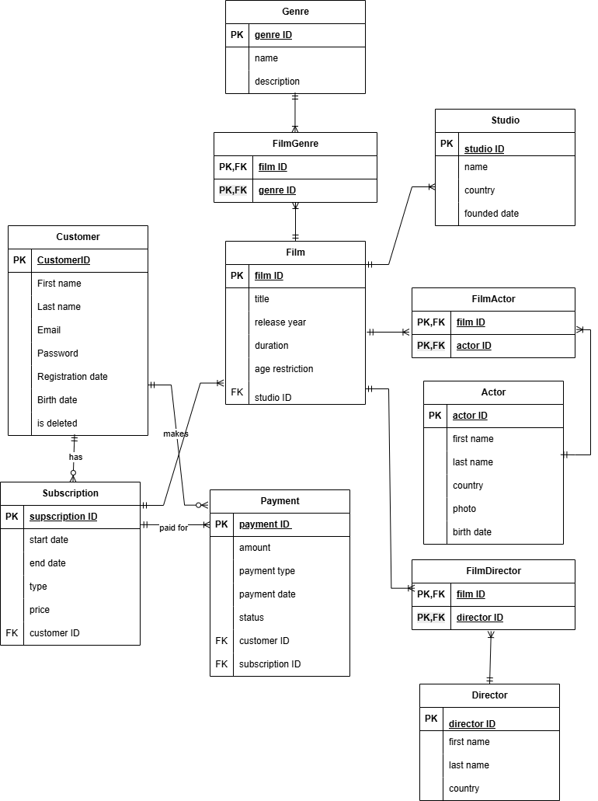

# Streaming Service for lab 1

ER-diagram для стримінгового сервісу

# 1. Короткий виклад вимог

Система призначена для зберігання та управління інформацією про онлайн-сервіс перегляду фільмів. Основними зацікавленими сторонами є користувачі платформи (клієнти) та адміністрація сервісу.

Користувачі можуть реєструватися в системі, оформлювати підписку на сервіс та оплачувати її. Система повинна зберігати особисті дані користувачів, інформацію про їх підписки та здійснені платежі.

Також система повинна зберігати інформацію про фільми, включаючи назву, рік випуску, тривалість та вікові обмеження. Кожен фільм пов'язаний зі студією, яка його створила, може мати одного або кількох режисерів, акторів та жанрів.

Необхідно забезпечити зберігання інформації про:

-клієнтів сервісу;

-підписки на сервіс;

-платежі за підписку;

-фільми;

-студії;

-режисерів;

-акторів;

-жанри.

Система повинна підтримувати зв'язки між фільмами та їх режисерами, акторами та жанрами.

# 2. Список сутностей та їх атрибутів

## **Customer**

Зберігає інформацію про користувачів сервісу.

- Атрибути:

  - CustomerID (PK) – унікальний ідентифікатор користувача

  - FirstName – ім'я

  - LastName – прізвище

  - Email – електронна пошта

  - Password – пароль

  - RegistrationDate – дата реєстрації

  - BirthDate – дата народження

  - IsDeleted – позначка видаленого акаунта

## **Subscription**

Зберігає інформацію про підписки користувачів.

- Атрибути:

  - SubscriptionID (PK) – ідентифікатор підписки

  - StartDate – дата початку

  - EndDate – дата завершення

  - Type – тип підписки

  - Price – ціна

  - CustomerID (FK) – посилання на користувача

## **Payment**

Зберігає інформацію про платежі за підписку.

 - Атрибути:

  - PaymentID (PK) – ідентифікатор платежу

  - Amount – сума платежу

  - PaymentType – тип оплати

  - PaymentDate – дата платежу

  - Status – статус платежу

  - CustomerID (FK) – користувач

  - SubscriptionID (FK) – підписка

## **Film**

Зберігає інформацію про фільми.

- Атрибути:

  - FilmID (PK) – ідентифікатор фільму

  - Title – назва

  - ReleaseYear – рік випуску

  - Duration – тривалість

  - AgeRestriction – вікове обмеження

  - StudioID (FK) – студія

## **Studio**

Зберігає інформацію про кіностудії.

Атрибути:

  - StudioID (PK) – ідентифікатор студії

Name – назва

Country – країна

FoundedDate – дата заснування

**Director**

Зберігає інформацію про режисерів.

Атрибути:

DirectorID (PK) – ідентифікатор режисера

FirstName – ім'я

LastName – прізвище

Country – країна

**Actor**

Зберігає інформацію про акторів.

Атрибути:

ActorID (PK) – ідентифікатор актора

FirstName – ім'я

LastName – прізвище

Country – країна

Photo – фотографія

BirthDate – дата народження

**Genre**

Зберігає інформацію про жанри фільмів.

Атрибути:

GenreID (PK) – ідентифікатор жанру

Name – назва жанру

Description – опис

# 3. Пояснення зв'язків

Customer — Subscription
Один користувач може мати кілька підписок або жодної. Кожна підписка належить одному користувачу.

Customer — Payment
Користувач може здійснювати багато платежів.

Subscription — Payment
Кожна підписка може мати один або кілька платежів.

Film — Studio
Кожен фільм створюється однією студією, але одна студія може створити багато фільмів.

Film — Director (FilmDirector)
Фільм може мати кількох режисерів, а режисер може працювати над багатьма фільмами. Для цього використовується проміжна таблиця FilmDirector.

Film — Actor (FilmActor)
Фільм може мати багато акторів, а актор може зніматися в багатьох фільмах.

Film — Genre (FilmGenre)
Фільм може належати до кількох жанрів, а один жанр може бути у багатьох фільмах.

4. Припущення та обмеження

Кожен користувач реєструється з унікальною електронною поштою.

Один користувач може мати кілька підписок у різний час.

Підписка має визначений період дії (дата початку і завершення).

Кожен платіж пов'язаний з конкретною підпискою.

Один фільм може мати кількох акторів, режисерів і жанрів.

Один актор або режисер може брати участь у багатьох фільмах.

Кожен фільм створюється тільки однією студією.
